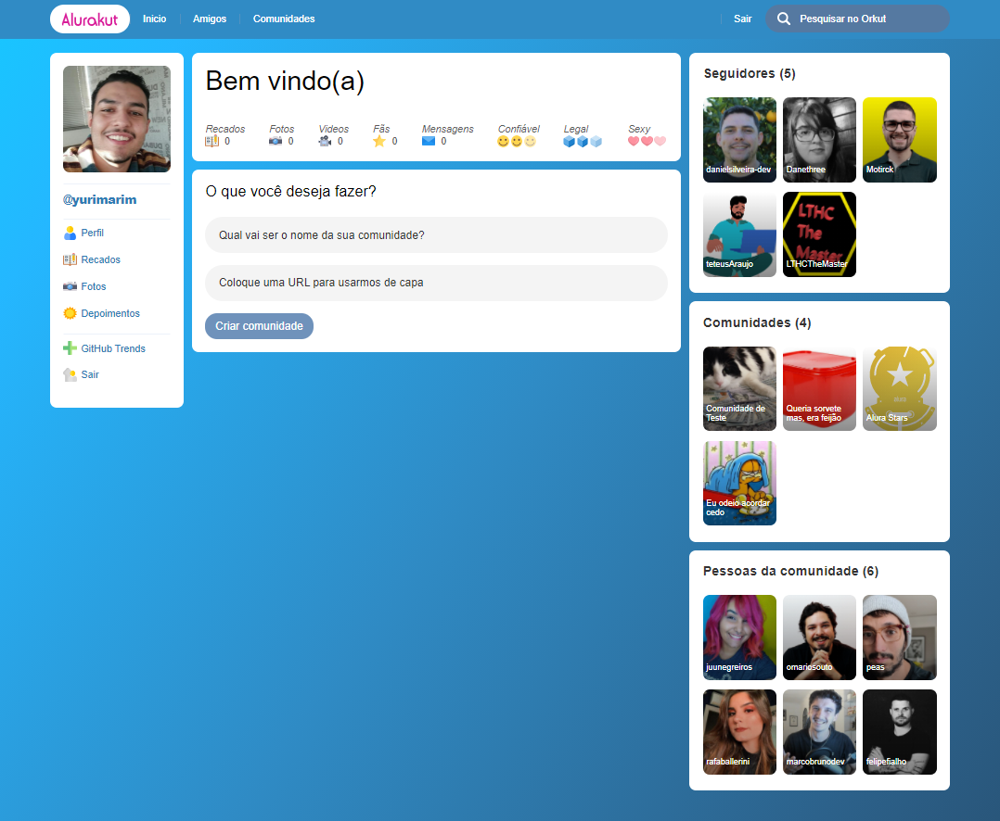

<h1 align="center">Alurakut</h1>
<h3 align="center">Projeto desenvolvido durante a 3° edição da Imersão React da Alura</h3>

## Clique para visualizar o projeto:

- [Clique aqui](https://imersao-react-alurakut-roan.vercel.app)

## Projeto



## Objetivo

- Simular e construir a interface da antiga rede social Orkut.

## Tecnologias Utilizadas e Documentações

- [ ] [React](https://pt-br.reactjs.org/docs/getting-started.html)
- [ ] [Vercel](https://vercel.com/docs)
- [ ] [DatoCMS](https://www.datocms.com/docs)

## Clonar o projeto

```bash
# Clone o rep
$ git clone https://github.com/yurimarim/imersao-react-alurakut.git

# Entre na pasta raiz
$ cd SoulsKut

# Instale as depêndencias
$ yarn

# Rode o projeto(acesse http://localhost:3000)
$ yarn start
```

[](https://github.com/yurimarim/imersao-react-alurakut/blob/main/LICENSE.txt)

Feito por Yuri Marim. [Entre em contato!](https://www.linkedin.com/in/yuri-marim-6b6130197/)
